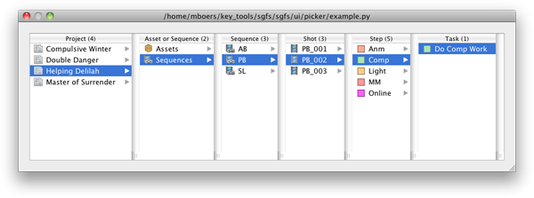

.. _index:

sgfs
=========

.. image:: https://secure.travis-ci.org/westernx/sgfs.png
    :alt: Test Status
    :target: http://travis-ci.org/westernx/sgfs

This Python package is a translation layer between `Shotgun <http://www.shotgunsoftware.com/>`_ entities and a file structure on disk. In general, its overarching tasks are to:

- map Shotgun entities to their canonical path on disk;
- map paths on disk to the coresponding Shotgun entities;
- create new structures on disk;
- indentify existing structures on disk for use in above translation.

We also provide a number of Qt Widgets to assist in working with Shotgun:

Contents
--------

.. toctree::
    :maxdepth: 2
    
    overview
    commands
    
    sgfs

    known_issues

Low-Level APIs
--------------

.. toctree::
    :maxdepth: 2
    
    template
    
    context
    schema
    structure
    
    cache
    utils
    processor

Indices and tables
==================
* :ref:`genindex`
* :ref:`modindex`
* :ref:`search`

